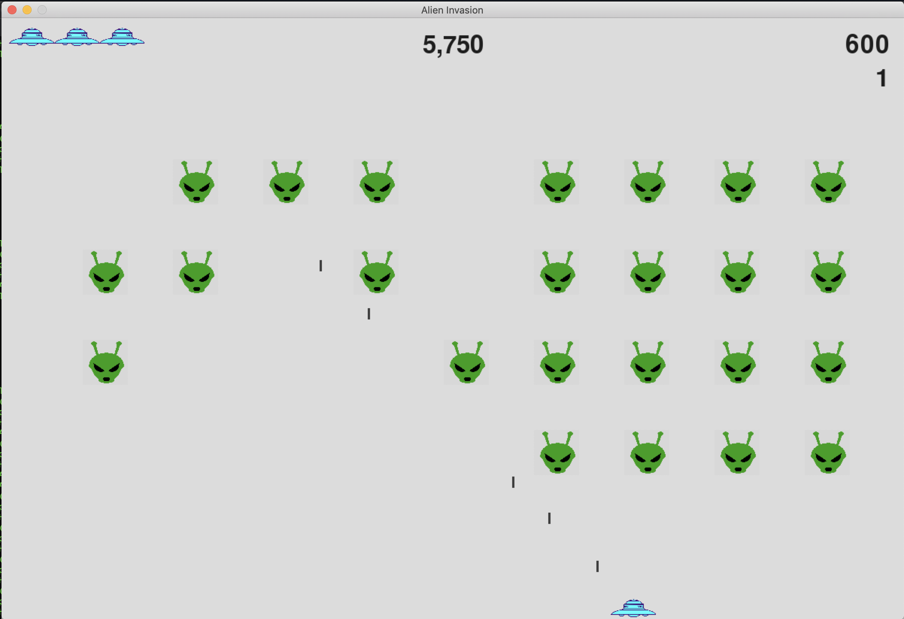

# Alien Invasion
Python Implementation of the Alien Invasion Game.
Produced after "Python Crash Course" by Eric Matthes.

## Getting Started
These instructions will get you a copy of the project up and running on your local machine for development and testing purposes.

### Installing
#### Mac OS
On Mac OS with [homebrew](https://brew.sh) and [Anaconda](https://www.anaconda.com/distribution/), execute the following commands (largely taken from [here](https://stackoverflow.com/questions/29137369/installing-pygame-module-in-anaconda-mac)):
```
$ brew install hg sdl sdl_image sdl_ttf
$ brew install sdl_mixer portmidi
$ conda install anaconda-client
$ conda install -c https://conda.binstar.org/quasiben pygame
```

### Execution
```
$ python alien_invasion.py
```

## Screenshot


## License
TODO
